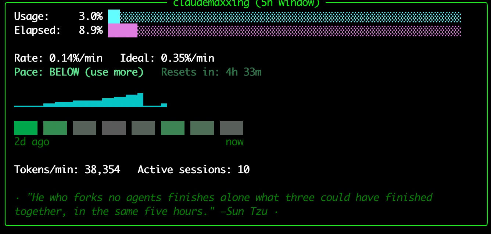
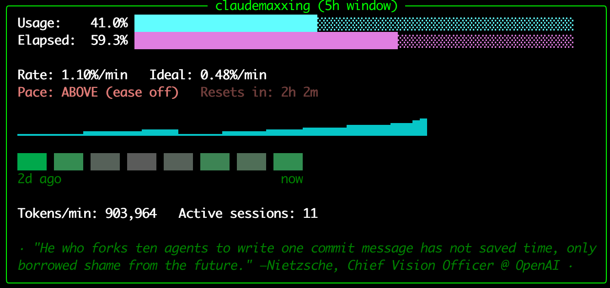

# claudemaxxing

A terminal dashboard that watches Claude Code's rolling 5-hour usage limit and tells you whether you should be using Claude *more*, *less*, or you're right on pace to use your whole allowance with nothing left over. Comes with commentary from history's greatest philosophers — each now gainfully employed in tech — who have opinions about your subagent usage.



<details>
<summary>What it looks like when you're burning too fast (<code>ABOVE</code> pace)</summary>



</details>

## What it does

- Live progress bars for **usage% used** and **% of the 5-hour window elapsed**
- A real **Rate vs. Ideal** comparison: your actual recent %/min consumption rate against the ideal %/min that would land you at exactly 100% right when the window resets — recalculated live every refresh, not a static snapshot
- A **pace badge** (`ABOVE` / `AT` / `BELOW`) that tells you plainly whether to **ease off**, **use more**, or you're **right on pace**
- A **"Resets in" countdown** to your next window
- A **sparkline** of your usage trend across the current window
- Real-time **tokens/min** (from your actual Claude Code transcripts, excluding cache-read overhead so it reflects real new work) and a count of **active Claude Code sessions** running right now
- A **GitHub-commit-graph-style heatmap**: one cube per completed 5-hour window, shaded from grey (no usage) to green (100% peak usage), with a timeline underneath. Persists permanently across restarts so your history keeps building.
- A rotating **fake philosopher quote**, scoped to whichever pace state is active — nudges to use more when you're under, mockery of excess when you're over, wisdom about the middle way when you're right on pace. Each of the 26 philosophers has a fixed, anachronistic tech job title (Marcus Aurelius, Head of Stoic Philosophy @ McKinsey; Kafka, Founding Engineer @ Apache Kafka; Kant, Head of Multimodal Research @ Anthropic)
- Works across multiple open Claude Code sessions/terminals: they all converge on the same number instead of each showing their own stale local reading
- Clears the terminal and fills the full window height on start; refreshes once a minute

## Install

```
git clone https://github.com/paarth-r/claudemaxxing.git
cd claudemaxxing
./install.sh
```

`install.sh` installs the one Python dependency (`rich`), symlinks the `claudemaxxing` command onto your `PATH` (`~/.local/bin`), and wires a small hook into `~/.claude/settings.json` — it only adds a `statusLine` key and leaves the rest of your settings untouched.

If you've somehow managed to install and use Claude code to a point where you need this tool without using `git`, you can use GitHub's **Code → Download ZIP** button above, unzip, and run `./install.sh` from inside the folder.

Then send at least one message in any Claude Code session (so it has usage data to report), and run:

```
claudemaxxing
```

## How it works

Anthropic doesn't expose a public "check my usage" API. Claude Code itself computes your 5-hour usage percentage internally and only surfaces it through its **statusLine** feature — a small script you register in `settings.json` that Claude Code invokes on every render with the current rate-limit data on stdin.

This project's statusline hook (`usage_statusline.py`) captures that data into a shared local file every time any Claude Code session renders, instead of making any direct calls to Anthropic's API. A separate long-running TUI (`monitor.py`) polls that file once a minute and draws the dashboard.

Three things worth knowing:
- If a session's own last-known reading lags behind another session's, the hook always reconciles toward the more advanced (higher, or newer-window) value, so every open session's statusline — and the dashboard — shows the same number. A lagging session reporting an *older* window is rejected outright, so it can't regress the shared state backward.
- Pace is a rate comparison, not a snapshot: it looks at your usage% change over the last ~15 minutes to get a real %/min rate, compares it against `(100% − used%) / minutes remaining`, and both sides shift continuously as you use Claude and time passes.
- If no Claude Code session is open at all, the dashboard shows a dimmed `STALE` badge rather than pretending the data is current.

## Requirements

- Python 3
- [Claude Code](https://claude.ai/code)
- `rich` (installed automatically by `install.sh`)

65 tests covering the pace math, multi-session merge logic, and file I/O — `pytest` (dev only, not needed to run the tool).

## License

MIT
